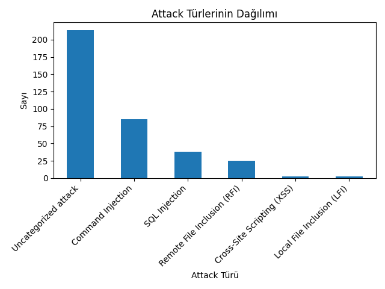
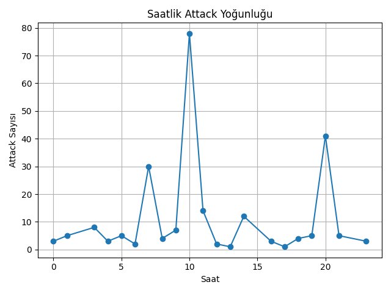
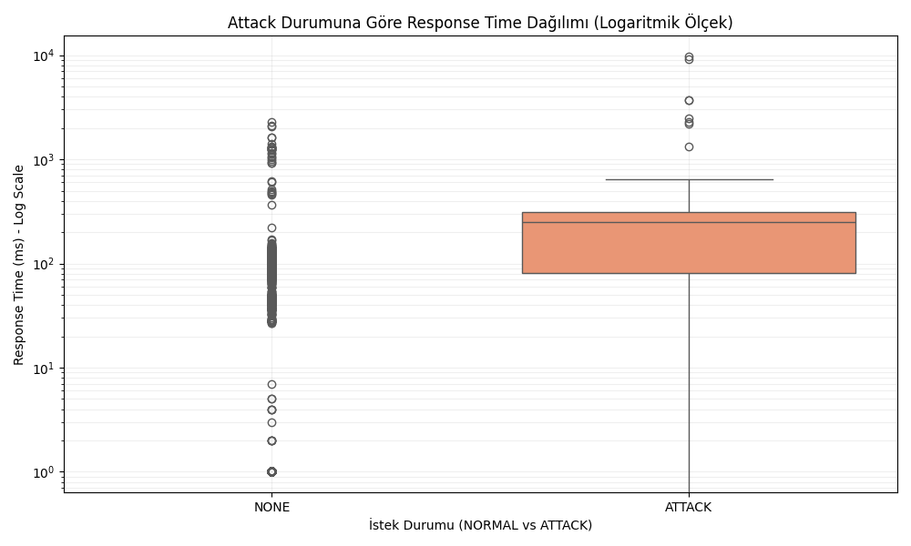

# Web Uygulaması Log Saldırı Analizi

PostgreSQL üzerinde tutulan web uygulaması loglarının Python kullanılarak saldırı davranışları açısından analiz edilmesi.

## 📋 Proje Hakkında

Bu proje, web uygulaması loglarını analiz ederek potansiyel saldırı davranışlarını tespit etmeyi amaçlamaktadır. Analiz kapsamında:

- **Saldırı Oranı**: Toplam istekler içindeki saldırı yüzdesi
- **Saldırı Türleri**: Kategori bazlı saldırı dağılımı
- **Zaman Davranışı**: Saate bağlı saldırı yoğunluğu analizi
- **Performans Etkileri**: Response time karşılaştırması


##  Kurulum
requirements.txt gerekli kütüphaneleri install edin.

### PostgreSQL Veritabanını Başlatın

```bash
docker-compose up -d
```

Veritabanı `localhost:5433` portunda çalışacaktır.

## 💻 Kullanım

### Analiz Çalıştırma

```bash
python analiz.py
```

Bu script aşağıdaki analizleri gerçekleştirir:
- Saldırı oranı hesaplama
- Saldırı türlerinin dağılımı
- Saatlik saldırı dağılımı
- Route bazlı risk analizi
- HTTP method bazlı risk oranları
- Response time karşılaştırması
- attack durumuna göre Response Time Dağılımı 

### Grafikleri Oluşturma

```bash
python grafikler.py
```

Grafikler `output/` klasörüne kaydedilir.


## 📈 Grafikler

- `attack_types.png` - Saldırı türlerinin bar grafiği
- `hourly_attacks.png` - Saatlik saldırı yoğunluğu çizgi grafiği
- `method_risk.png` - HTTP method bazlı saldırı oranları
- `response_time_comparison_log.png` - attack durumuna göre Response Time Dağılımı


## 🗃️ Veritabanı Şeması

`logs` tablosu aşağıdaki sütunları içerir:

| Sütun | Açıklama |
|-------|----------|
| created_at | İstek zamanı |
| attack | Saldırı durumu (ATTACK/NORMAL) |
| category | Saldırı kategorisi |
| route | İstek yapılan endpoint |
| http_method | HTTP metodu |
| http_status_code | HTTP durum kodu |
| responsetime | Yanıt süresi |
| ip_address | İstemci IP adresi |
| country | Ülke bilgisi |

## Analizin Çıktıları

Genel Bakış
•  Toplam kayıt: 13,790 istek
•  Saldırı sayısı: 236
•  Saldırı oranı: %1.71

## Saldırı Türlerinin Dağılımı:


Yorum: Command Injection ve SQL Injection en sık karşılaşılan kategorize edilmiş saldırı türleri.

## Saatlik Attack Yoğunluğu


Yorum: Grafikteki 2 peak, saldırıların gün içinde
iki farklı zaman penceresinde yoğunlaştığını
ve sürecin zamana bağlı bir davranış gösterdiğini ifade eder çünkü grafik bir dağılım sergilediği için rastgelelik yoktur.

## HTTP Method Bazlı Attack Oranı


Yorum: Grafikte HTTP Method Bazlı Attack oranın tamamı Post üzerine yoğunlaşmakta.GET istekleri çoğunlukla yalnızca veri görüntüleme amacı taşırken,POST istekleri kullanıcıdan  veri gönderimi içermektedir.Bu nedenle saldırı gözlemlerinin POST istekleri altında toplanması,Saldırılarının tamamının request üzerinden gerçekleştiği söylenebilir.

## Attack durumuna göre Response Time Dağılımı (Logaritmik Ölçek)


## RESPONSE TIME ORTALAMALARI 
attack
ATTACK    354.483051
NONE        6.261861  olduğunu görüyoruz.

İdeal ortalama backend için ortlama 

Yorum:Grafik incelendiğinde normal trafik (NONE) değerlerinin logaritmik ölçekte düşük gecikme sürelerinde kümelendiği görülmektedir. Normal koşullarda backend ortalama response süresi 6.26 ms olup, backend sistemler için kabul edilen 1–50 ms aralığında ve oldukça iyi bir seviyededir. Ancak saldırı sırasında ortalama response süresi 354.48 ms’ye yükselmiştir. Bu değer backend için yavaş kabul edilen 150–400 ms aralığına girmekte ve normal duruma kıyasla yaklaşık 56 katlık (%5560) bir artışa karşılık gelmektedir. Sonuç olarak saldırı, sistemi tamamen çökertmemiş olsa da backend performansında ciddi bir bozulmaya ve sistem kararlılığında belirgin bir düşüşe neden olmuştur.

